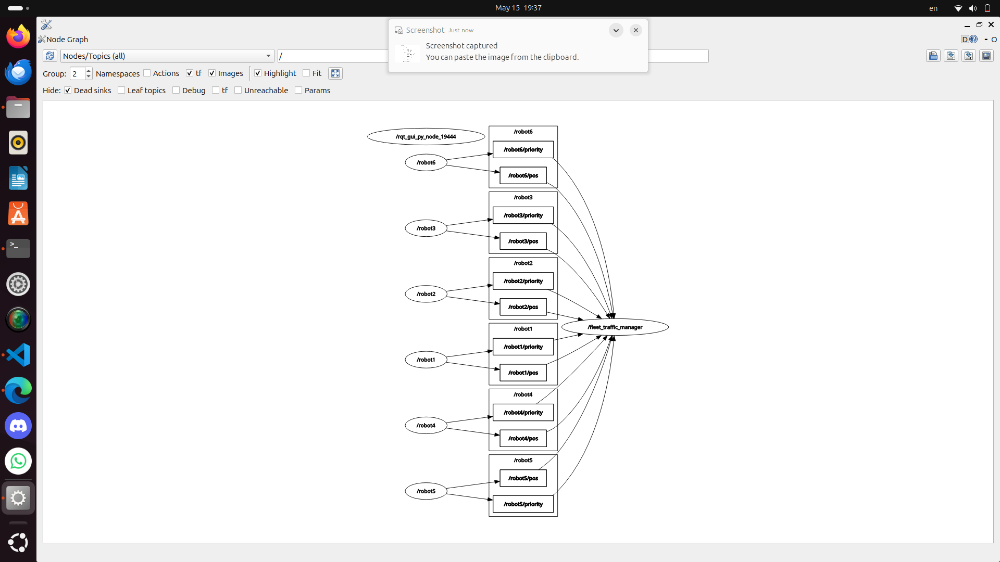
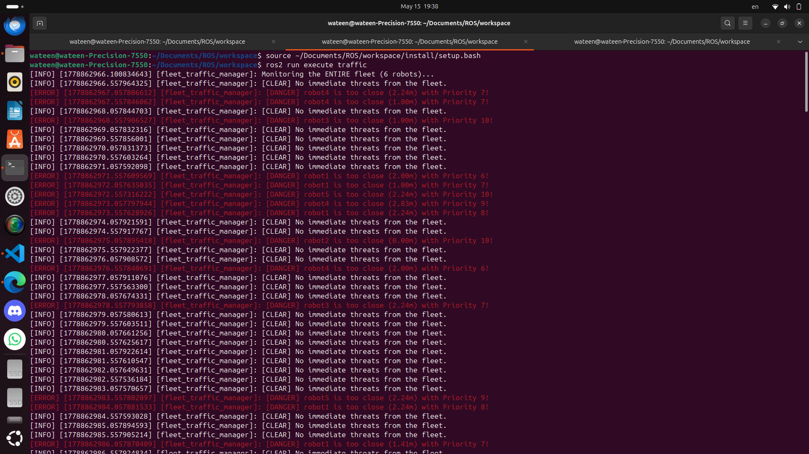

## RQT Graph

## Terminal output

## Notes
To handle the synchronization between the 2 incoming data streams:
- We make a list that keeps the latest information about every robot. 
- The distance calculations don't start until I have the position and the priority for a robot.

